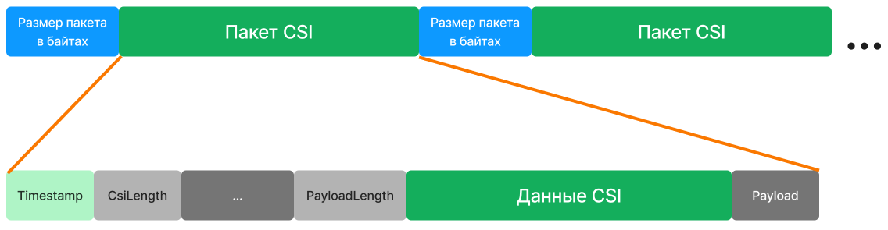

  

  <a href="https://github.com/maksimio/smartwifi">smart Wi-Fi</a>

Клиент-серверное программное обеспечение на Go / React для обработки данных Channel State Information (CSI). Предназначено для трех задач:
1. Управление маршрутизаторами (передачей данных CSI)
2. Вывод данных в реальном времени
3. Запись в файл в формате, совместимом с библиотекой [csiread](https://github.com/citysu/csiread) для Python

# Сервер-менеджер посылок CSI
Сервер принимает, декодирует, записывает и раздает посылки CSI, отправленных по TCP с роутера (функция _client_main_). На роутере установлена [модифицированная](https://github.com/xieyaxiongfly/Atheros_CSI_tool_OpenWRT_src) прошивка OpenWRT с [Atheros CSI Tool](https://wands.sg/research/wifi/AtherosCSI/)

ПО состоит из *интерфейса*, написанного на React + Typescript и *сервера*, написанного на Go.

# Запуск
`git clone https://github.com/maksimio/csidealer.git` - скопируйте репозиторий в терминале

## Сервер
1. `cd csidealer/server` - перейдите в серверную часть
2. `go get ./...` - установите зависимости
3. `go run cmd/app/main.go` - запустите серверное приложение
4. `go run test/faketcp.go` - запустите эмулятор посылок CSI в соседнем терминале
5. в директории `server` появится `config.yml`. Отредактируйте его содержимое при необходимости

Сервер на входа получает данные от маршрутизатора-приемника по протоколу TCP:

  

## Клиент
1. `cd csidealer/client` - перейдите в клиентскую часть (в новом терминале)
2. `npm i` - установите зависимости
3. `npm start` - запустите интерфейс
4. в консоли будет выведен адрес интерфейса, например `http://localhost:5173`. Необходимо перейти по нему

# Клиент
Для сервера предусмотрен интерфейс, который позволяет управлять записью CSI в файл и маршрутизаторами, а также выводить графики CSI в реальном времени с высокой частотой (20 Гц и более) через WebGL.

  
  
  

# Сервер
Назначение:
1. Прием и декодирование CSI из сырого TCP-трафика
2. REST API: взять n последних пакетов с CSI (ABS, PHASE, IM, RE), начать / остановить запись в файл и т.д.
3. Передача CSI по WebSocket
4. Фильтрация пакетов CSI

Архитектура сервера на Golang:

  

Через WEB-интерфейс отправляется команда на передачу данных CSI. Маршрутизаторы начинают передавать поток пакетов по TCP. Эти пакеты выделяются в потоке (buffer), декодируются, фильтруются и отправляются пользователю. По желанию пользователь может включить запись сырых данных в файл.